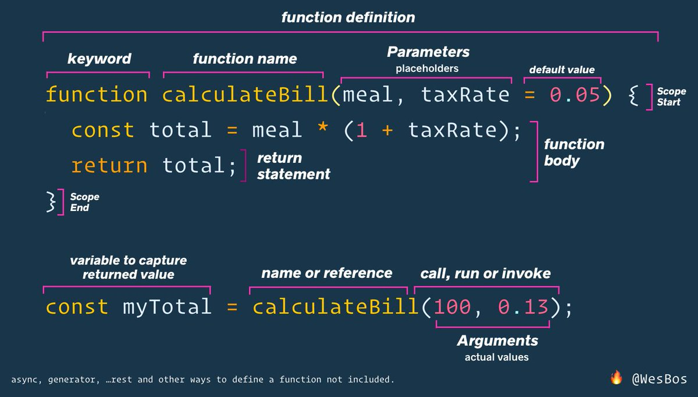

# Beginner JavaScript

These are the starter files and solutions to the [Beginner JavaScript](https://BeginnerJavaScript.com) course

## Function Definition Diagram



## Community Resources

Please feel free to add your blog post, videos, notes, or anything else related to the course :)

- [Soumya Ranjan Mohanty](https://github.com/geekysrm)'s [Github repo](https://github.com/geekysrm/javascript-notes) with notes and lessons learnt, along with [full notes here](https://notes.soumya.dev/javascript).
- [Linda has documented all her excercises on Codepen](https://twitter.com/lindakatcodes/status/1331702581220020225)
- [Cesar Gomez](https://github.com/CsarGomez) have a [GitHub repo](https://github.com/CsarGomez/beginnersJavascriptNotes) with notes for all the modules completed including exercises in [CopePen](https://codepen.io/collection/XjJQYz) other modules will be uploaded a soon as i finished each one

## My Notes

<https://wesbos.com/javascript>

## Debugging

- Console <https://wesbos.com/javascript/02-functions/debugging-tools/#console-debugging>
- Breakpoints <https://wesbos.com/javascript/02-functions/debugging-tools/#breakpoints>

## Functions

- Arrow functions are anonymous so they need to be attached to a variable.
  <https://wesbos.com/javascript/02-functions/different-ways-to-declare-functions/#arrow-functions>

- JavaScript has what is referred to as lexical scoping or static scoping. Variable look-up or scope look-up happens where the functions are defined not where they are run.
  <https://wesbos.com/javascript/03-the-tricky-bits/scope/#lexical-and-static-scoping>

- Functions declared with the `function` keyword are hoisted (moved to the top of the file).
  <https://wesbos.com/javascript/03-the-tricky-bits/hoisting/#hoisting-function-declarations>

## Variables

- `const` and `let` variables are block scoped
- `var` variables are not block scoped, they are function scoped.
- `const` and `let` variables are not available on the `window` object but `var` variables are. For example...

  - `const myConst = true; window.myConst; undefined`
  - `let myLet = true; window.myLet; undefined`
  - `var myVar = true; window.myVar; true`

  - Variable declarations are hoisted, but values aren't.
    <https://wesbos.com/javascript/03-the-tricky-bits/hoisting/#variable-hoisting>

## Closures

<https://wesbos.com/javascript/03-the-tricky-bits/closures/#examples-of-closures>

- The win function inside the createGame function can still access the score variable of the outer function scope even after the createGame() function has been 'closed over'.
- Useful for making 'private variables'.

  ```javascript
  function createGame(gameName) {
    let score = 0;
    function win() {
      score++;
      return `Your ${gameName} score is ${score}`;
    }
    return win;
  }
  ```

const footballGame = createGame('Football');
const tennisGame = createGame('Tennis');
// Attaches win function to the variables. Outer variable score is available to the inner win function.

footballGame();
tennisGame();
\\ Both function calls will have access to a private score variable.

````

## The DOM

- Intro
  <https://wesbos.com/javascript/04-the-dom/introduction-to-the-dom/#the-document-object-introduction>

- querySelector can be used on any element. <https://wesbos.com/javascript/04-the-dom/selecting-elements/#searching-inside-already-selected-elements>

# Adding Text

- textContent shows hidden nodes and elements. innerText is aware of styling and shows only actual text. <https://wesbos.com/javascript/04-the-dom/element-properties-and-methods/#textcontent-and-innertext>

- insertAdjacentText, best way to add text to elements. <<https://wesbos.com/javascript/04-the-dom/element-properties-and-methods/#insertadjacenttext-and-insertadjacentelemen>

# Data Attributes

- Data attributes are accessed with `.dataset`.
  <https://wesbos.com/javascript/04-the-dom/built-in-and-custom-data-attributes/#data-attributes>

# Creating & Adding HTML

- Create HTML with `document.createElement()`.
  <https://wesbos.com/javascript/04-the-dom/creating-html>
  <https://developer.mozilla.org/en-US/docs/Web/API/Document/createElement>
- Several ways to add elements to the page. <https://wesbos.com/javascript/04-the-dom/creating-html/#append-method>
  - Add elements to page with `appendChild()`. <https://developer.mozilla.org/en-US/docs/Web/API/Node/appendChild>
  - Or use newer `.append()`. <https://developer.mozilla.org/en-US/docs/Web/API/Element/append>
- Add elements in specific places with `insertAdjacentElement()`. <https://wesbos.com/javascript/04-the-dom/creating-html/#insertadjacentelement-method>
  - <https://developer.mozilla.org/en-US/docs/Web/API/Element/insertAdjacentHTML>

# Creating HTML with Strings

- Backticks can be used to create HTML with strings. <https://wesbos.com/javascript/04-the-dom/html-from-strings-and-xss>

  ```javascript
  const myHTML =`
    <div class="wrapper">
      <h1>Hello there</h1>
    </div>
````

- Backticks, variables and interpolation can be used for templating HTML.

  ```javascript
  const width = 500;
  const src = `https://picsum.photos/${width}`;
  const desc = 'A Pic of Something';
  const myHTML = `
  <div class="wrapper">
    <h1>Hello ${desc}</h1>
    
  </div>
  `;
  ```

- HTML added this way is still a string, it doesn't really create elements.

  ```javascript
  console.log(typeof myHTML); // Returns 'string'
  myHTML.classList.add('hello'); // Doesn't work as it's not really an element.
  ```

- You have to pull it out then do stuff with it.

  ```javascript
  const itemImage = document.querySelector('.wrapper img');
  itemImage.classList.add('special');
  ```

- Strings can be converted into a DOM element with .createRange().

  ```javascript
  const myFragment = document.createRange().createContextualFragment(myHTML);
  console.log(myFragment);
  ```

- Fragment can then be added to the DOM with appendChild(), append() or insertAdjacentElement() etc.

  ```javascript
  document.body.append(myFragment);
  ```

- **Security Concerns - XSS (Cross Site Scripting)**

  - Cross Site scripting is when a third party injects a script tag through a security hole.

  - Say the description above was a user input. They could add executabe code to the page

  ```javascript
  const desc = `A Pic of Something `;
  ```

  - Above is a pretty harmless examples, but it can leave sites open to serious attacks. <https://wesbos.com/javascript/04-the-dom/html-from-strings-and-xss/#xss-cross-site-scripting>

# Traversing the DOM

- Traversing the DOM to find parents, children, sibling etc. nodes and elements. <<https://wesbos.com/javascript/04-the-dom/traversing-and-removing-nodes/#properties-to-work-with-nodes-and-eleme>

- `$0` can be used in the console to get the last element selected in the elements tab.
- These will include nodes.

  ```javascript
  el.childNodes;
  el.firstChild;
  el.nextSibling;
  el.parentNode;
  el.parentElement;
  ```

- These will ignore nodes

  ```javascript
  el.firstElementChild;
  el.lastElementChild;
  el.previousElementSibling;
  el.nextElementSibling;
  el.children;
  ```

- Best to double check as it's not obvious from the names which ones include or ignore nodes

# Removing Elements

- Use `el.remove()`. <https://wesbos.com/javascript/04-the-dom/traversing-and-removing-nodes/#removing-elements>

- Elements may still be accessed after removal.

  ```javascript
  const para = document.createElement('p');
  para.textContent = 'Soon I will be gone!';
  document.body.append(para);
  para.remove();
  console.log(para); // Logs <p>Soon I will be gone!</p>
  ```

## Events

# Event Listeners

- <https://wesbos.com/javascript/05-events/event-listener>
- You can attach event listeners to all elements, as well as the document and the window.
- Takes two arguments. The event and a callback function.

  - A callback function is just a function one that will then be called at a later point in time.
    -The callback can be any type of function. Named, anonymous or arrow.

  ```html
  <button class="butts">Click Me!</button>
  ```

  ```javascript
  const butts = document.querySelector('.butts');
  function handleClick() {
    console.log('Click');
  }
  butts.addEventListener('click', handleClick);
  ```

- There are basically three steps...
  - Get something!
  - Listen for something!
  - Do something!
- To remove an event listener you need reference to the function. Won't work with anonymous functions. <https://wesbos.com/javascript/05-events/event-listener#removing-an-event-listener>

  ```javascript
  butts.removeEventListener('click', handleClick);
  ```

- Listen for events on multiple elements with `.forEach()`. <https://wesbos.com/javascript/05-events/event-listener#listening-to-events-on-multiple-elements>

  ```html
  <button class="buy">Buy Item 1</button>
  <button class="buy">Buy Item 2</button>
  <button class="buy">Buy Item 3</button>
  <button class="buy">Buy Item 4</button>
  <button class="buy">Buy Item 5</button>
  <button class="buy">Buy Item 6</button>
  <button class="buy">Buy Item 7</button>
  <button class="buy">Buy Item 8</button>
  <button class="buy">Buy Item 9</button>
  <button class="buy">Buy Item 10</button>
  ```

  ```javascript
  function buyItem() {
    console.log('Bought it!');
  }

  //Regular anonymous function
  buyButtons.forEach((buyButton) => {
    buyButton.addEventListener('click', buyItem);
  });

  // Or arrow function
  buyButtons.forEach((button) => button.addEventListener('click', buyItem));
  ```
